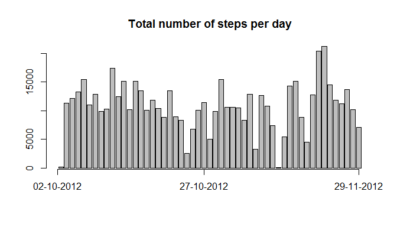
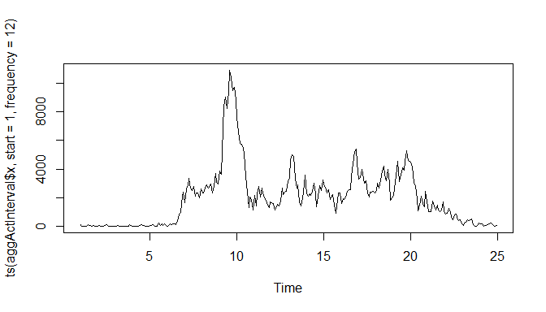
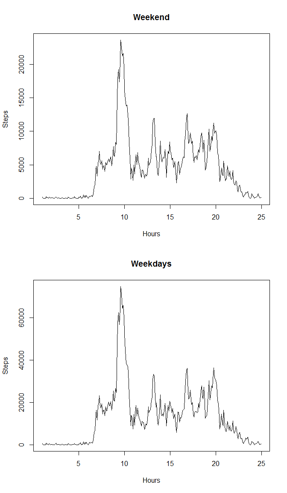

# Reproducible Research: Peer Assessment 1


## Loading and preprocessing the data
####Determine class of columns.

```r
activity <- read.csv(unz("activity.zip", "activity.csv"))
typeSteps<-class(activity$steps)
typeDate<-class(activity$date)
typeInterval<-class(activity$interval)
```
Types in data.frame activity are:  
* steps is a integer  
* date is a factor  
* interval is a integer

####Examine content

```r
head(activity)
```

```
##   steps       date interval
## 1    NA 2012-10-01        0
## 2    NA 2012-10-01        5
## 3    NA 2012-10-01       10
## 4    NA 2012-10-01       15
## 5    NA 2012-10-01       20
## 6    NA 2012-10-01       25
```

```r
summary(activity)
```

```
##      steps                date          interval     
##  Min.   :  0.00   2012-10-01:  288   Min.   :   0.0  
##  1st Qu.:  0.00   2012-10-02:  288   1st Qu.: 588.8  
##  Median :  0.00   2012-10-03:  288   Median :1177.5  
##  Mean   : 37.38   2012-10-04:  288   Mean   :1177.5  
##  3rd Qu.: 12.00   2012-10-05:  288   3rd Qu.:1766.2  
##  Max.   :806.00   2012-10-06:  288   Max.   :2355.0  
##  NA's   :2304     (Other)   :15840
```

####Change class of column date from factor to date

```r
activity$date <- as.Date(activity$date)
typeDateCh <- class(activity$date)
```
After change type of date: Date.

## What is mean total number of steps taken per day?
####Remove observations with NA from data.

```r
activityNoNA <- na.omit(activity)
aggActDaily<-aggregate(activityNoNA$steps, by=list(activityNoNA$date), "sum")
```
####Histogram daily activity.

```r
barplot(aggActDaily$x, main='Total number of steps per day')
axis(1,at=c(0,30.7,63.1),labels=c("02-10-2012","27-10-2012","29-11-2012"))
```

 

####Calculate mean and median.

```r
meanSteps<-mean(aggActDaily$x)
medianSteps<-median(aggActDaily$x)
```
The mean total number of steps per day is 1.0766189\times 10^{4}.  
The median total number of steps per day is 10765.

## What is the average daily activity pattern?
####Calculate steps per interval.

```r
aggActInterval<-aggregate(activityNoNA$steps, by=list(activityNoNA$interval), "sum")
```
####Plot average steps per day in 5 minute interval starting at 00:00 unit 23:55

```r
plot.ts(ts(aggActInterval$x,start=1,frequency=12))
```

 

####Determine interval with highest number of average steps.

```r
maxStepsInt <- max(aggActInterval$x)
maxTime<-aggActInterval$Group.1[aggActInterval$x==maxStepsInt]
```
Time with the highest average daily steps is 835.
  
## Imputing missing values
####Number of missing values.

```r
sumNAsteps<-sum(is.na(activity$steps))
```
Total number of missing values (NA) is: 2304.

####Use the mean for a interval to give NA's in 'steps' a value.

```r
newActivity<-activity
newActivity$steps[is.na(newActivity$steps)]<-aggActInterval$x[match(newActivity$interval[is.na(newActivity$steps)],aggActInterval$Group.1)]
```

####Calculate the mean and median of the new dataset 

```r
aggNewActDaily<-aggregate(newActivity$steps, by=list(newActivity$date), "sum")
newMeanSteps<-mean(aggNewActDaily$x)
newMedianSteps<-median(aggNewActDaily$x)
```
The mean of steps of the new dataset (no NA) is 8.4188066\times 10^{4}, the old one was 1.0766189\times 10^{4}.

The median of steps of the new dataset (no NA) is 11458, the oldone was 10765.

####Both the values are significant higher.


## Are there differences in activity patterns between weekdays and weekends?
####New variable voor weekend and weekday in dataframe.

```r
newActivity$date <- as.Date(newActivity$date)
newActivity$weekend<-factor(ifelse(weekdays(newActivity$date) %in% c("zaterdag","zondag"),"weekend","weekday"))
```


```r
WeekendActivity<-subset(newActivity,weekend=="weekend")
WeekdayActivity<-subset(newActivity,weekend=="weekday")
weekendAggAct<-aggregate(WeekendActivity$steps, by=list(WeekendActivity$interval), "sum")
weekdayAggAct<-aggregate(WeekdayActivity$steps, by=list(WeekdayActivity$interval), "sum")
par(mfrow=c(2,1))
plot.ts(ts(weekendAggAct$x,start=1,frequency=12),main="Weekend",xlab="Hours",ylab="Steps")
plot.ts(ts(weekdayAggAct$x,start=1,frequency=12),main="Weekdays",xlab="Hours",ylab="Steps")
```

 
